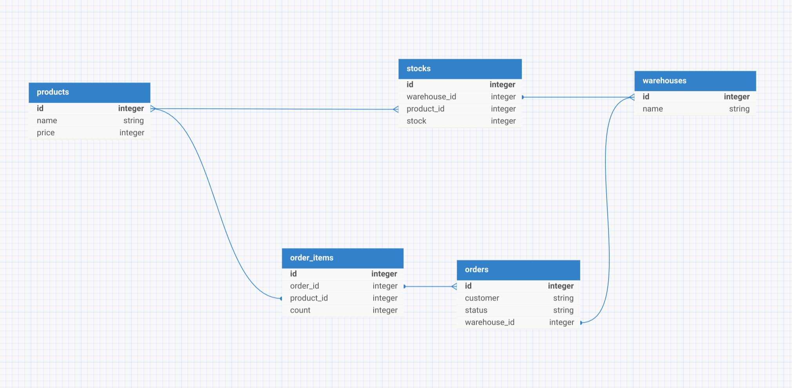

## Задача

[Микро-CRM для торговли](Task.md)

## Диаграмма 

## Предварительные требования
- PHP >= 8.2
- Composer
- mysql
- Laravel >= 11

## Установка

- git clone
- cd yandex-market-task
- .env.example -> .env, подключить бд mysql
- php artisan migrate 
- php artisan serve
- php artisan db:seed (Для заполнения бд моковыми данными)
- импортируем в postman [Market.postman_collection.json](Market.postman_collection.json)